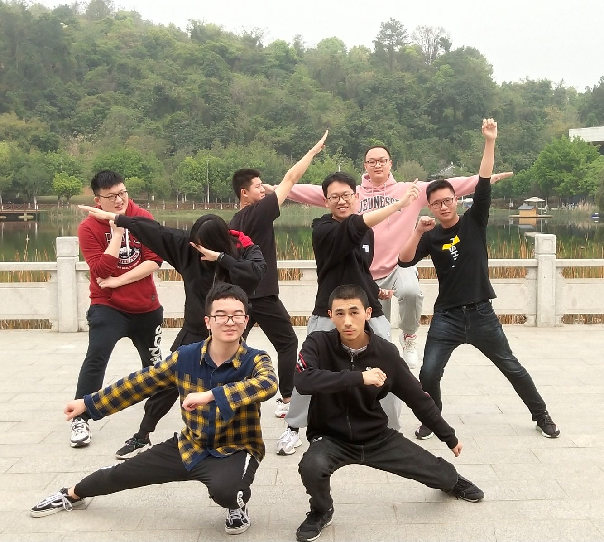

# Concerto 团队展示
|这个作业属于哪个课程|[课程](https://edu.cnblogs.com/campus/fzu/2021SpringSoftwareEngineeringPractice)|
|---	|---	|
|这个作业要求在哪里|[作业要求]()|
|这个作业的目标|团队展示，确定选题|

## 队名
> Concerto
> 

## 团队项目描述
> 针对小团队快速启动的协助辅助工具
> 

## 队员风采
> **学号** 221801317
> 
> **成员昵称**  sarise
> 
> **成员博客园地址**  https://www.cnblogs.com/sariseBlog/
> 
> **成员性格**  淡定
> 
> **擅长的技术** java后端
> 
> **兴趣爱好**   咖啡 小提琴
> 
> **希望的软工角色** 后端 PM
> 
> **一句slogan**   笑就好了 :D

> **学号** 081700318
> 
> **成员昵称**  aaagx
> 
> **成员博客园地址**   https://www.cnblogs.com/aaagx/
> 
> **成员性格**  开朗活泼
> 
> **擅长的技术**  安卓开发 
> 
> **兴趣爱好**   打电动
> 
> **希望的软工角色** 前端 测试
> 
> **一句slogan**   摇了我吧

>> **学号** 021800713
> 
> **成员昵称**  Kroos
> 
> **成员博客园地址**  https://www.cnblogs.com/LINX666
> 
> **成员性格**  不温不火
> 
> **擅长的技术** 貌似没有很擅长的
> 
> **兴趣爱好**   足球、电影
> 
> **希望的软工角色** 前端、后端
> 
> **一句slogan**   俺只是一个搬运工

> **学号** 221801322
> 
> **成员昵称**  笑颜一等赏
> 
> **成员博客园地址**  https://www.cnblogs.com/caihan/
> 
> **成员性格**  慢热
> 
> **擅长的技术** Web
> 
> **兴趣爱好**   动漫、游戏
> 
> **希望的软工角色** 前端
> 
> **一句slogan**   我的精神世界决不能被蚀成废铁

> **学号** 221801431
> 
> **成员昵称**  Letoo
> 
> **成员博客园地址**  https://www.cnblogs.com/LetooJ/
> 
> **成员性格**  自闭
> 
> **擅长的技术** java后端
> 
> **兴趣爱好**   听音乐、发呆、乱画
> 
> **希望的软工角色** 后端、测试
> 
> **一句slogan**   呜啦啦啦啦啦啦啦！
> 

> **学号** 021800623
> 
> **成员昵称**  SiO2
> 
> **成员博客园地址**  https://www.cnblogs.com/fzu-wmz/
> 
> **成员性格**  沉默
> 
> **擅长的技术** 暂无
> 
> **兴趣爱好**   动漫
> 
> **希望的软工角色** 后端
> 
> **一句slogan**   勇敢地去追求月亮吧，就算失败也会落入群星之间。
> 

> **学号** 081800330
> 
> **成员昵称**  EdmundzzZ
> 
> **成员博客园地址**  https://www.cnblogs.com/EdmunddzzzzzZ/
> 
> **成员性格**  哦？
> 
> **擅长的技术** IOS前端 PC逆向
> 
> **兴趣爱好**   看会书
> 
> **希望的软工角色** ios前端
> 
> **一句slogan**  祝你今天愉快，你明天的愉快留着我明天再祝
> 

> **学号** 221600234
> 
> **成员昵称**  李子李子李
> 
> **成员博客园地址**  https://www.cnblogs.com/reborn-Li/
> 
> **成员性格**  不温不火、慢热、与人熟络之后会很热情
> 
> **擅长的技术** 无
> 
> **兴趣爱好**   烹饪（2021年给家里人做了一次年夜饭）
> 
> **希望的软工角色** 后端、测试
> 
> **一句slogan**   希望能成为一个温柔的人
> 

## 团队合照

## 绩效考核方案
## 团队愿景